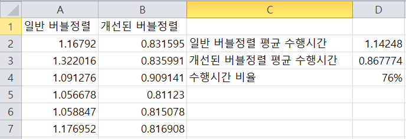

# 버블 정렬(Bubble Sort)
기존 Bubble Sort를 구현하고, 이를 좀 더 개선한 버전의 알고리즘도 구현해 봅니다.

## 컴파일 환경
- 우분투 리눅스(14.04)
- g++

## 컴파일 커맨드
```
$ make
```

## 실행 방법
```
$ ./main [정렬할 원소개수] [랜덤시드]
```
랜덤시드는 0~99의 값으로, 값에 따라서 정렬할 원소가 다르게 생성됩니다.    
정렬할 원소는 lgcrand로 인하여 자동적으로 생성됩니다.    
정렬할 원소 개수를 조정함으로써, 계산부하를 조절할 수 있습니다.

실행 결과는 다음과 같게 나올 수 있습니다.
```
$ ./main 10000 2
10000 2
Normal Bubble Sort - Elapsed Time: 3.816618
Optimized Bubble Sort - Elapsed Time: 2.806098
< Correctness Check >
Bubble Sort - Success
Optimized Bubble Sort - Success
```
첫 번째 줄에 입력한 원소 수와, 랜덤시드가 덤프됩니다.   
두번째와 세번째 줄에는 각각 일반 버블정렬과 개선된 버블정렬로 원소들을 정렬하는 데에 걸린 시간이 출력됩니다.    
그리고 다섯번째 줄과 여섯번째 줄은 C++ STL algorithm헤더에 구현된 퀵소트로 정렬한 값과 비교하여 각각 버블 정렬과 개선된 버블 정렬의 결과와 같은지, 다른지를 확인하여 알고리즘의 정확성을 검증합니다.

## 알고리즘 설명
일반 버블 정렬은 N개의 원소일 경우 인접한 항목의 크기 비교를 N^2번 실시하고 뒤쪽 항목이 값이 더 작을 경우 서로 값을 스위치합니다.  
개선된 버블 정렬은, 정렬을 하는 도중 일정 인덱스 이후의 원소들이 스위치되지 않을 경우 다음 반복문에서는 해당 부분은 모두 정렬이 되었다고 가정하고 넘어가게 됩니다.   
Big-Oh 표기법에서는 두 알고리즘 다 O(N^2)의 시간 복잡도를 갖지만, Best Case인 이미 다 정렬이 된 경우 일반 버블 정렬은 똑같이 O(N^2)의 시간 복잡도를 갖지만 개선된 버블 정렬은 O(N)의 시간 복잡도를 갖습니다.    
반면에 Worse Case인 역으로 정렬된 경우에는 둘다 똑같이 O(N^2)의 시간 복잡도를 갖습니다.

## 알고리즘 수행시간 분석
    
1만개의 항목에 대하여, 시트값 0~99까지 총 100회의 테스트를 거쳤습니다.    
해당 테스트케이스에 대하여 알고리즘은 정확히 구현된것으로 나타났으며, 평균 수행시간이 개선된 알고리즘이 기존 알고리즘에 비해 24%정도의 수행시간이 단축된 것으로 나타났습니다.